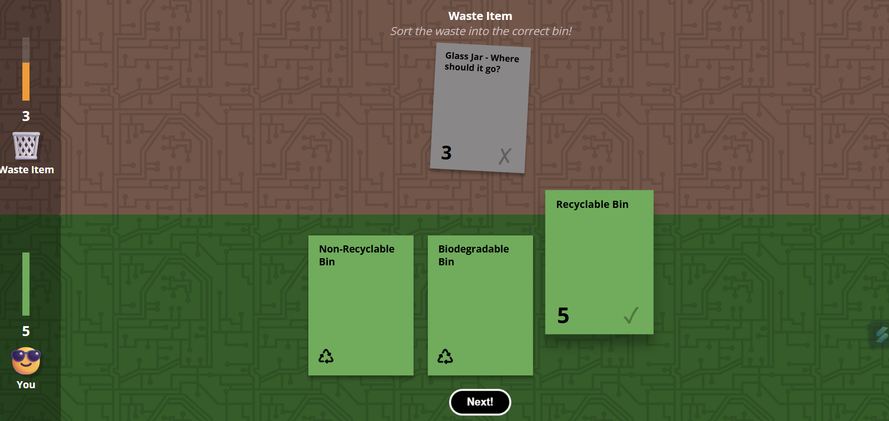
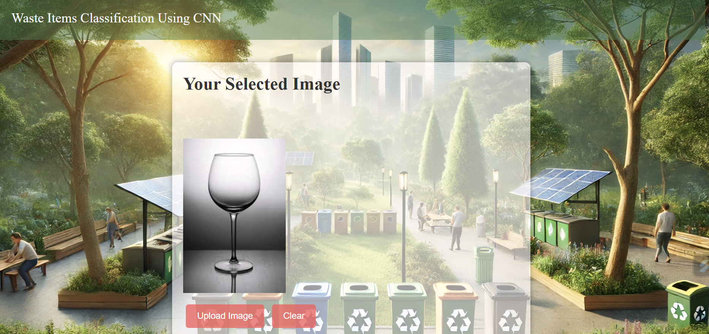
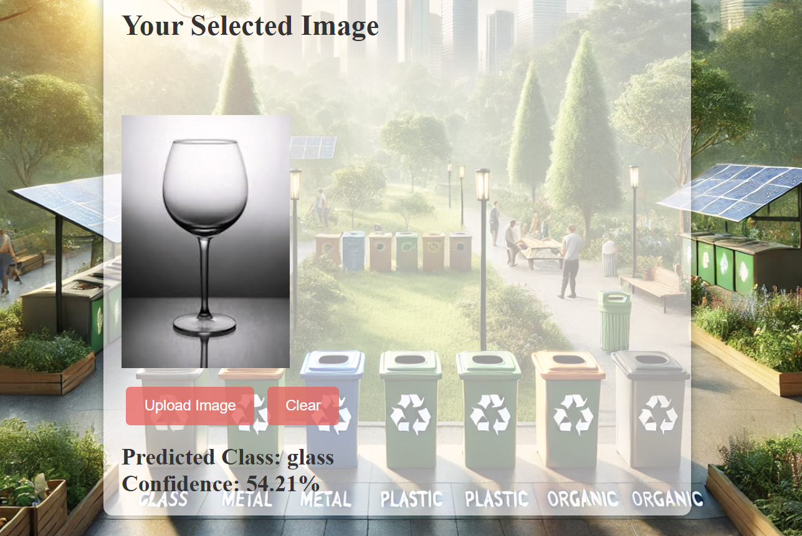

# WasteQuestAI
## 🚀 Features
- 🎮 **Waste Segregation Game** 
- 🤖 **CNN Model Prediction** - Predict waste categories using AI.
- 🕶️ **AR Application** - Experience waste segregation in an interactive way.
- **Gradio UI Code**
---
Dataset:Download Trashnet Dataset and Unzip the Folder dataset-resized and 
Place the dataset-resized Folder,Training.ipynb,download.jpg in a Training Folder,
The Training Folder Should be in the Same Directory as of models
----
## Output

